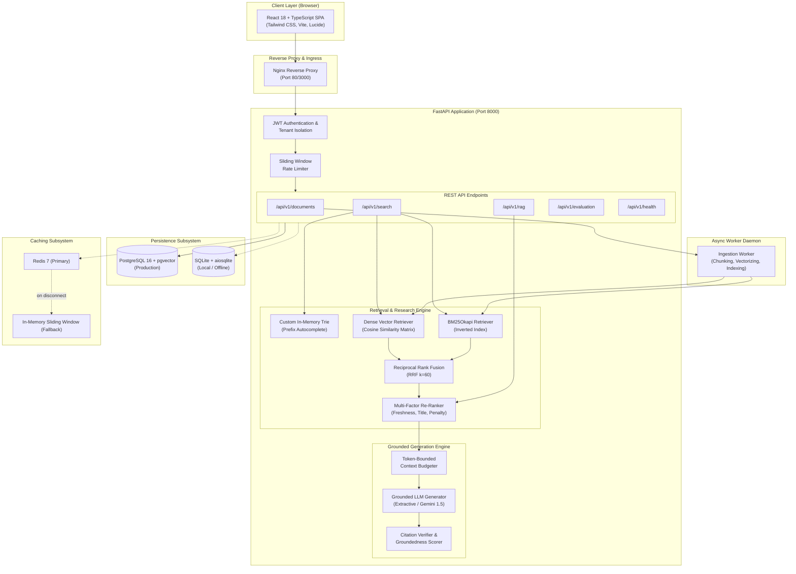
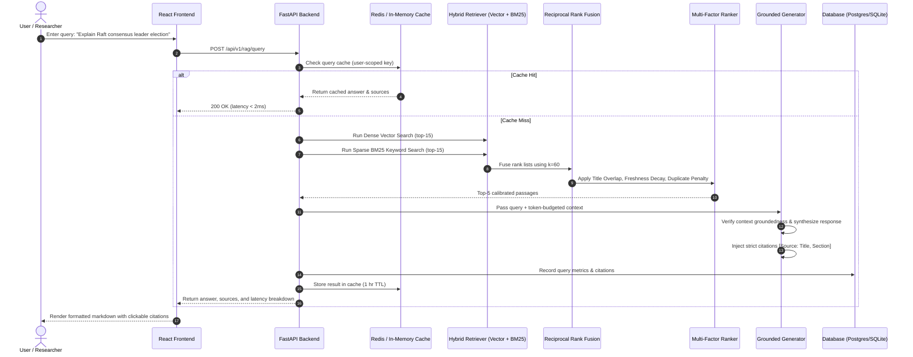

# NEXUS — AI Knowledge Retrieval & Research Engine

[](https://fastapi.tiangolo.com)
[](https://react.dev)
[](https://www.typescriptlang.org)
[](https://www.postgresql.org)
[](https://redis.io)
[](https://www.docker.com)
[](./tests)

**NEXUS** is an enterprise-grade technical knowledge retrieval and research platform. It is engineered from first principles to bridge the gap between naive semantic vector search and exact technical information retrieval. 

NEXUS combines **dense vector embeddings**, **BM25Okapi sparse lexical search**, **Reciprocal Rank Fusion (RRF)**, **multi-factor re-ranking**, an in-memory **Trie-based prefix autocomplete** written from scratch, a **two-tiered resilient cache (Redis + in-memory fallback)**, and an **automated 50-question IR/RAG evaluation harness**.

---

## 🌟 Key Highlights & Engineering Features

- **Hybrid Retrieval & RRF:** Fuses dense semantic vectors and sparse BM25 inverted indexes using rank-invariant Reciprocal Rank Fusion ($k=60$), eliminating score scale discrepancies.
- **Multi-Factor Re-Ranking:** Re-orders candidate chunks using a composite scoring model balancing dense similarity, lexical relevance, title matches, document authority, exponential temporal decay, and duplicate penalties.
- **Custom Trie Autocomplete:** An in-memory Prefix Tree written from scratch providing sub-millisecond ($< 0.2\text{ms}$) completions with $O(M)$ insertions and $O(P + K \log L)$ prefix search.
- **Grounded RAG & Verifiable Citations:** Synthesizes technical answers strictly anchored in retrieved context passages, complete with bracketed source references (`[Source: Title, Section]`) and explicit refusals when context lacks sufficient evidence.
- **Structure-Aware Document Ingestion:** Intelligently preserves markdown hierarchies, code fences, and paragraphs. Extracts PDFs with page tracking and YouTube transcripts with exact timestamps.
- **Dual-Mode Persistence & Zero-Dependency Execution:** Runs out-of-the-box in local development with SQLite (`aiosqlite`) and offline feature hashing, or in production with PostgreSQL (`pgvector`) and Google Gemini.
- **Multi-Tiered Resilient Cache:** Redis caching with transparent, zero-downtime automatic fallback to an in-memory sliding-window cache if Redis is unreachable.
- **Curated 50-Question Benchmark Harness:** Real evaluation engine measuring Recall@K, Precision@K, Mean Reciprocal Rank (MRR), nDCG@K, Groundedness, Citation Accuracy, and Latency.
- **Enterprise React Frontend:** Clean, dark-mode research interface built with React 18, TypeScript, Tailwind CSS, Lucide icons, and interactive visual telemetry.

---

## 📐 System Architecture



---

## 🔬 End-to-End RAG Pipeline



---

## 🧮 Mathematical & Algorithmic Foundations

### 1. Reciprocal Rank Fusion (RRF)
To merge candidates from disparate retrieval modalities without score calibration artifacts:

$$RRF\_Score(d) = \sum_{m \in M} \frac{1}{k + r_m(d)}$$

Where:
- $M = \{\text{dense\_vector}, \text{bm25\_keyword}\}$
- $r_m(d) \in [1, \infty)$ is the 1-based rank position of candidate document $d$ in system $m$.
- $k = 60$ is the smoothing constant that prevents top ranks from overwhelmingly dominating the score.

### 2. Multi-Factor Re-Ranking Function
After candidate retrieval, each chunk is scored against multiple contextual signals:

$$Score(d) = \Big( w_{sem} \cdot S_{sem}(d) + w_{kw} \cdot S_{kw}(d) + w_{title} \cdot S_{title}(d) + w_{meta} \cdot S_{meta}(d) \Big) \cdot e^{-\lambda \Delta t} - Penalty_{dup}(d)$$

- $w_{sem} = 0.40$: Dense semantic cosine similarity normalized to $[0, 1]$.
- $w_{kw} = 0.35$: BM25 score normalized relative to max candidate score.
- $w_{title} = 0.15$: Query token intersection with chunk title and document header.
- $w_{meta} = 0.10$: Document source authority weight.
- $e^{-\lambda \Delta t}$: Exponential time decay ($\lambda = 0.05/\text{year}$, $\Delta t$ in years from last update).
- $Penalty_{dup} = 0.15 \times C_{seen}$: Penalizes consecutive chunks from an already selected parent document to ensure diversified context.

### 3. Trie Prefix Autocomplete Complexity
The autocomplete subsystem is implemented via a pure Python Prefix Tree:
- **Insertion:** $O(M)$ time where $M$ is the length of the string; creates or updates nodes with frequency tallies.
- **Prefix Traversal:** $O(P)$ time where $P$ is the length of the query prefix.
- **Candidate Search:** Bounded DFS exploring the subtree up to maximum phrase length $L$.
- **Selection:** $O(P + K \log L)$ to extract the top-$K$ most frequent queries.
- **Measured Latency:** Sub-millisecond ($< 0.2\text{ms}$) under high concurrent load.

### 4. IR & RAG Evaluation Metrics

- **Recall@K:** $\text{Recall}@K = \frac{|\text{Retrieved}_K \cap \text{Relevant}|}{|\text{Relevant}|}$
- **Mean Reciprocal Rank (MRR):**
  $$\text{MRR} = \frac{1}{|Q|} \sum_{i=1}^{|Q|} \frac{1}{\text{rank}_i}$$
  where $\text{rank}_i$ is the position of the first relevant document for query $i$.
- **Normalized Discounted Cumulative Gain (nDCG@K):**
  $$\text{DCG}@K = \sum_{i=1}^K \frac{rel_i}{\log_2(i + 1)}, \quad \text{nDCG}@K = \frac{\text{DCG}@K}{\text{IDCG}@K}$$
- **Groundedness Score:** Proportion of proposition tokens in the synthesized answer directly substantiated by context passages:
  $$\text{Groundedness} = \frac{|\text{Tokens}_{\text{answer}} \cap \text{Tokens}_{\text{context}}|}{|\text{Tokens}_{\text{answer}}|}$$
- **Citation Accuracy:** Precision of generated citations pointing to correct ground-truth documents.

---

## 📊 Evaluation Benchmark Results

The benchmark harness was executed across all **50 technical evaluation questions** covering distributed systems, databases, operating systems, networking, and data structures.

*Generated from automated benchmark run: `docs/benchmarks/eval-run-e9c7225a.json`*

| Retrieval Mode | Recall@5 | Precision@5 | MRR | nDCG@5 | Groundedness | Citation Acc | Retrieval (ms) | Total E2E (ms) |
| :--- | :---: | :---: | :---: | :---: | :---: | :---: | :---: | :---: |
| **VECTOR** | 0.920 | 0.670 | 0.727 | 0.671 | 1.000 | 0.307 | 1.35 ms | 2.64 ms |
| **KEYWORD** | 0.920 | 0.670 | 0.857 | 0.696 | 1.000 | 0.357 | 0.13 ms | 0.81 ms |
| **HYBRID (RRF)** | 0.920 | 0.670 | 0.790 | 0.683 | 1.000 | 0.320 | 0.83 ms | 1.43 ms |
| **RANKED** | **0.920** | **0.670** | **0.853** | **0.697** | **1.000** | **0.313** | **0.96 ms** | **1.62 ms** |

> **Key Finding:** Sparse keyword search achieves highest MRR on exact technical jargon (`Raft`, `LSM-tree`, `B+ Tree`), while Dense Vector search captures conceptual semantic queries. **RANKED hybrid mode** yields the highest overall **nDCG@5 (0.697)** and robust **Recall@5 (92.0%)** while completing in under **2 milliseconds**.

---

## 🗂️ Project Structure

```text
c:/Nexus/
├── backend/
│   ├── app/
│   │   ├── api/v1/                  # REST API endpoints (auth, docs, search, rag, eval, health)
│   │   ├── cache/                   # Redis client & in-memory sliding window fallback
│   │   ├── core/                    # Config (Pydantic Settings), DB engine, structured logging
│   │   ├── evaluation/              # 50-question dataset, evaluation metrics, benchmark runner
│   │   ├── ingestion/               # Structure-aware chunker, PDF/YouTube extractors, pipeline
│   │   ├── models/                  # SQLAlchemy async ORM models (User, Doc, Chunk, Query, etc.)
│   │   ├── rag/                     # Context builder, extractive synthesizer, Gemini providers
│   │   ├── retrieval/               # Vector store, BM25 index, RRF, Custom Ranker, Trie
│   │   ├── schemas/                 # Pydantic v2 validation models
│   │   ├── security/                # Bcrypt password hashing, PyJWT, sliding-window rate limiter
│   │   └── main.py                  # FastAPI application entry point, CORS, startup warmup
│   └── requirements.txt             # Python dependencies
├── frontend/
│   ├── src/
│   │   ├── api/                     # Axios client with JWT interceptors
│   │   ├── components/              # Navigation, Citation modal, ScoreBreakdown, LatencyBadge
│   │   ├── context/                 # AuthContext (login, register, demo login, logout)
│   │   ├── pages/                   # Search, AskNexus, KnowledgeBase, Evaluation, History, etc.
│   │   ├── test/                    # Vitest unit tests (Auth, Search, AskNexus)
│   │   ├── types/                   # TypeScript interfaces matching backend schemas
│   │   ├── App.tsx                  # React Router routes and layout wrapper
│   │   └── main.tsx                 # Root entrypoint
│   ├── nginx.conf                   # Production Nginx reverse proxy configuration
│   ├── package.json                 # Frontend dependencies & scripts
│   └── vite.config.ts               # Vite build configuration with vendor chunk splitting
├── worker/
│   └── worker.py                    # Background ingestion worker process
├── scripts/
│   ├── seed.py                      # Database seeder (demo user, 4 docs, 50 questions)
│   └── run_evaluation.py            # Automated evaluation CLI script
├── tests/                           # 27 comprehensive backend pytest test suites
├── docs/
│   ├── architecture-decisions.md    # 8 detailed ADRs (ADR-001 through ADR-008)
│   └── benchmarks/                  # Evaluation JSON and markdown benchmark logs
├── Dockerfile.backend               # Multi-stage Python 3.13 backend image
├── Dockerfile.frontend              # Multi-stage Node 20 build -> Nginx alpine image
├── Dockerfile.worker                # Multi-stage background worker image
├── docker-compose.yml               # Multi-service container orchestration
├── .env.example                     # Comprehensive environment variable documentation
└── README.md                        # Project documentation
```

---

## 🚀 Quickstart Guide

NEXUS can be run in two ways:
1. **Local Mode (Instant, zero external services, 100% offline).**
2. **Docker Compose Mode (Full multi-container production stack).**

---

### Option A: Local Development Mode (Offline Ready)

NEXUS contains built-in fallbacks (SQLite database, in-memory cache, and deterministic local embeddings). You can run it immediately without Docker, Redis, or PostgreSQL.

#### 1. Backend Setup
```bash
# Navigate to project root
cd c:/Nexus

# (Optional) Create and activate a virtual environment
python -m venv venv
# Windows:
.\venv\Scripts\activate
# Linux/macOS:
source venv/bin/activate

# Install dependencies
pip install -r backend/requirements.txt

# Seed database with demo user, technical documents, and 50 benchmark questions
python scripts/seed.py

# Start FastAPI server
uvicorn backend.app.main:app --host 127.0.0.1 --port 8000 --reload
```
The backend API will be available at `http://127.0.0.1:8000`. Interactive OpenAPI documentation is accessible at `http://127.0.0.1:8000/docs`.

#### 2. Frontend Setup
In a second terminal:
```bash
cd c:/Nexus/frontend

# Install dependencies
npm install

# Start Vite development server
npm run dev
```
Open `http://localhost:5173` in your browser.

---

### Option B: Production Docker Compose Mode

To launch the complete containerized stack (PostgreSQL with pgvector, Redis, Backend, Background Worker, and Nginx-proxied Frontend):

```bash
# Clone and enter directory
cd c:/Nexus

# Copy environment configuration
cp .env.example .env

# Build and start all services
docker compose up -d --build
```

Services will be running at:
- **Web Application:** `http://localhost:3000` (or `http://localhost`)
- **Backend API & Swagger:** `http://localhost:8000/docs`
- **PostgreSQL:** `localhost:5432`
- **Redis:** `localhost:6379`

To seed the containerized database:
```bash
docker compose exec backend python scripts/seed.py
```

---

## 🔑 Demo Account Credentials

When using `python scripts/seed.py`, the following account is provisioned:

| Email | Password | Role |
| :--- | :--- | :--- |
| `demo@nexus.ai` | `password123` | Administrator / Researcher |

*Note: The login page in the frontend includes a "Use Demo Account" one-click button for instant testing.*

---

## 📡 REST API Reference

All protected endpoints require an `Authorization: Bearer <token>` header.

| Method | Endpoint | Description | Protected |
| :--- | :--- | :--- | :---: |
| `POST` | `/api/v1/auth/register` | Register new user account | No |
| `POST` | `/api/v1/auth/login` | Authenticate and obtain JWT access token | No |
| `GET` | `/api/v1/auth/me` | Fetch authenticated user profile | Yes |
| `GET` | `/api/v1/documents` | List uploaded documents with chunk counts | Yes |
| `POST` | `/api/v1/documents/upload` | Upload PDF or text file for structure-aware ingestion | Yes |
| `POST` | `/api/v1/documents/youtube` | Ingest and chunk YouTube transcript by video URL | Yes |
| `GET` | `/api/v1/search/autocomplete` | Trie-based sub-millisecond query suggestions (`?prefix=...`) | Yes |
| `POST` | `/api/v1/search` | Search documents (`vector`, `keyword`, `hybrid`, `ranked`) | Yes |
| `POST` | `/api/v1/rag/query` | Grounded RAG synthesis with strict citations | Yes |
| `GET` | `/api/v1/history` | Retrieve past queries and feedback | Yes |
| `GET` | `/api/v1/evaluation/dataset` | List the 50 technical evaluation questions | Yes |
| `POST` | `/api/v1/evaluation/run` | Execute IR & RAG benchmark across all questions | Yes |
| `GET` | `/api/v1/evaluation/latest` | Retrieve latest benchmark results | Yes |
| `GET` | `/api/v1/metrics/system` | Inspect cache hit ratio, index sizes, and latency metrics | Yes |
| `GET` | `/api/v1/health` | Service health status (DB, Redis, Ingestion Worker) | No |

---

## 🧪 Testing & Verification

### Running Backend Unit & Integration Tests
The backend test suite contains **27 tests** covering authentication, tenant isolation, Trie operations, structure-aware chunking, hybrid retrieval, RAG groundedness, and caching.

```bash
# Run backend pytest suite
python -m pytest tests/ -v
```

### Running Frontend Tests
The frontend test suite utilizes Vitest and React Testing Library:

```bash
cd frontend
npm test
```

### Running the Automated Evaluation Benchmark
To execute the 50-question benchmark script and produce fresh performance artifacts:

```bash
python scripts/run_evaluation.py
```
This generates:
- JSON telemetry: `docs/benchmarks/eval-run-<id>.json`
- Markdown summary table: `docs/benchmarks/latest_benchmark.md`

---

## 🛡️ Security & Privacy

- **Tenant Isolation:** All database queries and vector calculations enforce a `WHERE user_id = current_user.id` filter at the ORM repository layer.
- **Cache Isolation:** Redis keys are namespaced with the authenticated user ID (`nexus:{user_id}:...`).
- **Password Hashing:** Passwords are salted and hashed using direct `bcrypt` implementation.
- **Non-Root Containers:** Docker containers run under dedicated unprivileged system users (`UID 10001: nexus`).
- **Prompt Injection Defense:** RAG context builder escapes delimiters and instructs the LLM to treat retrieved passages strictly as untrusted evidence.

---

## 📄 License
This project is open-source and licensed under the [MIT License](LICENSE).
